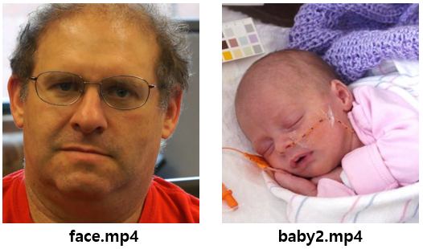

# Homework Assignment 2 
### Eulerian Video Magnification

<p align='right'>
  2021314078 배은지
</p>

Eulerian Video Magnification : 육안으로 볼 수 없는 미묘한 변화들을 추출하는 알고리즘

<p align='center'>
  
</p>

두 동영상 ( face, baby ) 에서 아래와 같은 순서로 진행
1. If your video has color, transform it to an appropriate color space.
2. Create a Laplacian pyramid for each video frame.
3. Band-pass filter the time series for each pixel, on all levels of the pyramid.
4. Magnify bands of interest by some scale.
5. Reverse the Laplacian pyramid and undo the color transform to obtain the final output.

### INITIALS AND COLOR TRANSFORMATION
- Load the video file
- extract frames
- convert double-precision in the range [0,1]
- convert YIQ color space (RGB ↔ YIQ : rgb2ntsc ↔ ntsc2rgb)

```matlab
video = VideoReader('data/baby2.mp4');
%video = VideoReader('data/face.mp4');

Fs = round(video.FrameRate);
l=video.Duration * video.FrameRate;
length = round(l);
h = video.Height;
w = video.Width;
ch = video.BitsPerPixel / 8;

frame_list = zeros(h, w, ch, length);

for frame_index = 1: length-1
    video.CurrentTime = frame_index * 1 / video.FrameRate;
    frame = readFrame(video);
    frame = double(frame) / 255;
    frame = rgb2ntsc(frame);
    frame_list(:, :, :, frame_index) = frame(:, :, :);
end

video.CurrentTime = l * 1 / video.FrameRate;
frame = readFrame(video);
frame = double(frame) / 255;
frame = rgb2ntsc(frame);
frame_list(:, :, :, frame_index) = frame(:, :, :);
[h, w, ch, frame_num] = size(frame_list);
```
